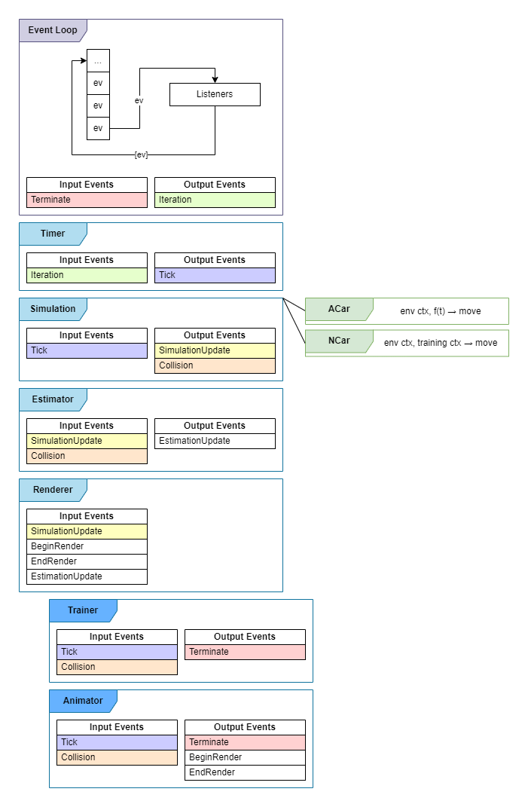

# AutoSim

## Description
This project has a following goal: to create a software complex, including application, to simulate synchronous car motion (in terms of speed & distance, not direction) and develop an intellectual agent to control the car. The agent must be trained using genethic algorithm. Supported motion topologies should include at least line and circle.

## Architecture

App is implemented around the key component: event loop.

### Components

#### Event Loop
Now sync.
Consists of queue holding Event objects, and a list of Listner objects.
Each iteratrion loop produces corresponding events, which were in the queue in the beginning of iteration. After that produced events are added to the queue.

Following components exist entirely inside event loop:
1. **Timer** (Just timer. Produces tick events periodically or one-shoot)
1. **Simulation** (Handles object polling and collision detection)
1. **Estimator** (Scores cars according to simulation and estimation parameters)
1. **Renderer** (Creates movie from simulation. PIL, OpenCV)

#### Cars
1. **ACar** (Determined car to move according to _f(t)_)
2. **BCar** (Car moving using trained neural network)

#### Trainer
Creates event loops and is part of them. Runs simulation and polls estimator. Generates NCars using NCars and ACars.

#### Animator
TBD. Probably to be deleted. 

    
Diagram

     
    

## Kanban
Project uses following kanban board: https://artdubrovskikh.kanbantool.com/b/995135

## GitHub
Project is maintained on GitHub: https://github.com/artem701/genalg

## Benchmarks
Benchmarks can be found [here](doc/benchmarks.md).                                                        
